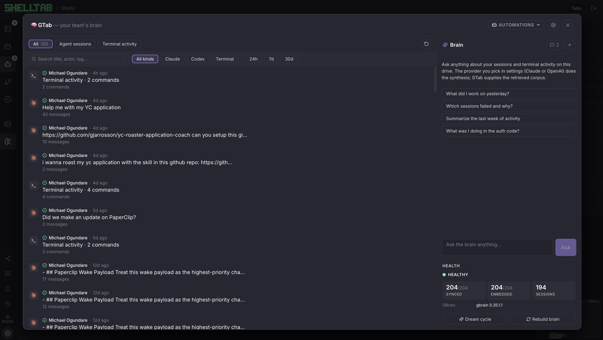

# GTab

> **A shared team brain — fed by every Claude Code and Codex session your team runs.**

Your team works alongside Claude Code and Codex every day. Each session ends, the work disappears, the next session starts cold. Multiply that across an org and you're paying for the same investigation, the same context, the same explanation — over and over.

GTab fixes that. Every prompt, every command, every file touched flows into a shared [GBrain](https://github.com/garrytan/gbrain) — Garry Tan's open-source compounding memory system. The brain is yours. It auto-chunks, auto-embeds, auto-links, and runs a nightly dream cycle to enrich itself. Your team queries it.

## What your team gets

- **Onboarding in an afternoon** — new hire Asks the brain, learns everything the team and its agents have ever done
- **Agents that learn from each other** — your Claude reads what a teammate's Codex did yesterday before it starts
- **No more "who did what?"** — every action attributed to a human or an agent, searchable forever
- **Incident archaeology** — *"what changed auth between Monday and Wednesday?"* → real answer, cited from real sessions
- **The work *is* the documentation** — no Notion sprawl, no stale wikis, no re-typing what just happened



*Real activity inside [ShellTab](https://shelltab.dev) — every agent session and terminal action, attributed, queryable, feeding a live GBrain corpus you can Ask anything.*

> Garry Tan, May 9 2026: *"the future belongs to individuals who build compounding AI systems, not to individuals who use corporate-owned centralized AI tools."*
>
> **GBrain just landed. GTab is the protocol layer that lets every terminal product plug into it.**

---

## Quickstart

```bash
git clone https://github.com/ShellTabHQ/gtab
cd gtab/docker
docker compose up
```

Open <http://localhost:8080>. The **Brain View** tile renders against a pre-baked sample corpus — six anonymized pages across multiple actors and agents. No accounts, no signups, no API keys.

Put a real page in:

```bash
docker exec -i gtab-gbrain gbrain put shell/session/2026-05-16/my-first-session \
  < ./examples/sample-corpus/shell/session/2026-05-16/01hxsess_auth_refactor_aa.md
```

It appears in the Brain View within seconds.

---

## Built on top of ShellTab

[ShellTab](https://shelltab.dev) is a multiplayer cloud terminal where engineers and AI agents collaborate in the same place. Multiple humans, multiple agents (Claude Code, Codex CLI), all working together — every keystroke runs through one observable surface.

ShellTab is the first full implementation of GTab and runs against this exact spec in production today. We extracted the protocol so **any terminal product** can adopt the same pattern. Fork the spec, become GBrain-native.

Built for the [GStack × GBrain Hackathon](https://events.ycombinator.com/GStack) (Y Combinator, May 16, 2026).

---

## What's in this repo

| Directory | Purpose |
|---|---|
| [`spec/`](./spec/) | **The contribution.** Page schema, slug conventions, sync protocol. Stable and versioned. |
| [`sync/`](./sync/) | Reference Bun sync daemon: terminal capture → Markdown → `gbrain put`. Fork it for your host. |
| [`brain-view/`](./brain-view/) | Portable Svelte component. Reads any GBrain HTTP server. Embeddable. |
| [`docker/`](./docker/) | `Dockerfile` + `docker-compose.yml` for the full standalone demo. |
| [`examples/`](./examples/) | Sample corpus + sample sync inputs. |

---

## Adopting GTab in your host

Any system that captures terminal sessions can publish to GBrain via the GTab spec:

1. Read [`spec/session-page-schema.md`](./spec/session-page-schema.md) for the frontmatter contract.
2. Read [`spec/slug-convention.md`](./spec/slug-convention.md) for stable identifiers.
3. Read [`spec/sync-protocol.md`](./spec/sync-protocol.md) for the sync-daemon contract (debounce, state, retries).
4. Translate your capture format → Markdown.
5. Publish via `echo "$markdown" | gbrain put <slug>` (CLI) or call the `put_page` MCP tool directly over `gbrain serve --http` (HTTP transport, default port 3131).
6. (Optional) Embed [`brain-view/`](./brain-view/) for the UI.

[`sync/`](./sync/) is a working reference sync daemon in ~200 lines of Bun. Fork it.

---

## Configuration

Want the HTTP MCP endpoint exposed alongside `docker compose up` (port 3131)? Set `ENABLE_GBRAIN_SERVE=1`. Note: this serializes CLI access on PGLite's lock, so the standalone demo keeps it off by default.

---

## Compatibility

- **GBrain**: v0.31.1+ (thin-client mode + HTTP transport required).
- **Node**: 20+ (for `brain-view/`). **Bun**: 1.0+ (for `sync/`).
- **MCP**: spec-compliant; uses the `put_page`, `list_pages`, `get_page`, `search`, `query`, `get_backlinks` tools.

---

## Status

- **v0.1.0** — hackathon release, May 16 2026. Schema v1. Reference sync daemon + portable Brain View.
- Phase 2 (post-hackathon, ~2 weeks): activity-cluster ingestion, streaming Ask AI, backlinks, dream-cycle button.
- Phase 3: cross-org aggregation, federated brains, schema migrations.

See [CHANGELOG.md](./CHANGELOG.md) for releases.

---

## License

MIT. See [LICENSE](./LICENSE).

---

## Maintainer

Maintained by [ShellTab HQ](https://shelltab.dev). PRs welcome.
